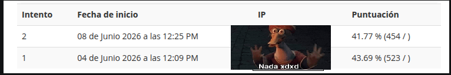

# Guía de examen MySQL

## ¿Qué es esto?

Este repositorio contiene ejercicios de MySQL Workbench basados en la guía de examen de mi semestre.

Los ejercicios abarcan temas como:

- LEFT JOIN y RIGHT JOIN
- Subconsultas
- Vistas (VIEW)
- Procedimientos almacenados (PROCEDURE)
- Funciones, condiciones y comodines
- Consultas con múltiples tablas

El objetivo de este repositorio es servir como material de práctica y repaso para exámenes de bases de datos utilizando MySQL.

Cada archivo contiene uno o varios ejercicios junto con su solución correspondiente.

## Herramientas utilizadas

- MySQL Workbench
- MySQL Server

## Calificación de la guía

No tengo idea de por que obtuve esa calificacion la captura del resultado se encuentra en este repositorio

Si encuentras algun error en las consultas o una posible mejora puedes abrir un issue o comentarlo!

## Ejercicios

### 1. Lista todas las películas junto con su categoría (si tiene), aunque no todas tengan una.

### 2. Lista todas las películas con los actores que participaron (aunque haya películas sin actores).

### 3. Crea un procedimiento almacenado para agregar un cliente y su dirección en una sola operación.

### 4. Crea un procedimiento almacenado para cambiar la dirección de un cliente y actualizar la dirección.

### 5. ¿Qué clientes han realizado más pagos que el cliente con menos pagos?

### 6. ¿Cuáles son las películas con más de 40 rentas? (Usando subconsulta en FROM).

### 7. Crea una consulta para responder: ¿Cuánto dinero ha recaudado cada miembro del staff en pagos?

### 8. Crea una consulta para responder: ¿Cuántas películas hay en cada categoría?

### 9. Crea una vista para mostrar las películas que nunca han sido rentadas.

### 10. Crea una vista para mostrar películas con su categoría (aunque no tengan categoría asignada).

### 11. Mostrar todas las películas, aunque no tengan categoría o actores asignados.

### 12. Mostrar todas las ciudades aunque no tengan direcciones ni tiendas.